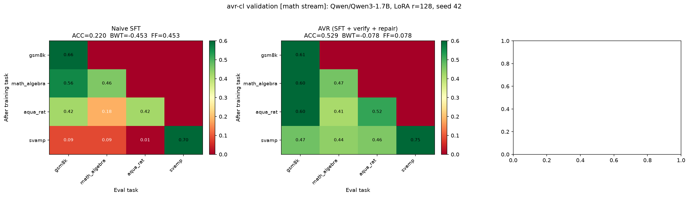

# avr-cl

**Your fine-tune silently broke your model. avr-cl tells you, and fixes it.**

<p align="center">
  
</p>

*Left: naive sequential SFT — prior tasks collapse (GSM8K 66% → 9%). Right: avr-cl — prior tasks survive (GSM8K 62% → 47%). Same model, same data, same LoRA.*

## The problem

Every "continual learning" method in LLMs is just continual absorption with weight updates. Absorb new data → update weights → try not to forget. EWC, replay, SLAO, AVR — all variations of the same thing: absorb → update → hope.

But that's not learning. When a human learns something new, they don't just absorb it and move on. They absorb it, then **verify** it against what they already know — does this break something I learned before? If it does, they **repair** the conflict. Then they check again. Only when the old knowledge still holds do they call it "learned."

Real learning is: **absorb → verify → repair → call it learned.**

Current CL does: **absorb → call it learned.**

The verify and repair steps are missing. That's why fine-tuning silently breaks models — nobody checked.

avr-cl builds those missing steps:

- **A** = Anchor — snapshot the model before learning
- **V** = Verify — check old tasks after absorption. Did anything break?
- **R** = Repair — fix what broke. Closed-form weight interpolation, no gradients, no old data

## Results

### Qwen3-1.7B — Math reasoning

4-task stream: GSM8K → MATH(algebra) → AQuA-RAT → SVAMP. LoRA r=128, 5000 examples/task.

| | Naive SFT | avr-cl |
|---|---|---|
| **BWT** | −0.453 | **−0.078** |
| **GSM8K after all 4 tasks** | 9% | **47%** |
| **ACC** | 0.220 | **0.529** |
| **Repair steps** | — | 29 |

5.8× less forgetting. The repair loop fired 29 times across 3 tasks — each time detecting PPL drift on prior tasks and pulling weights back until the drift resolved.

Results: [`results/qwen3_1.7b/`](results/qwen3_1.7b/)

### LFM2.5-230M — Intent classification (preliminary)

4-task stream: Banking77 → CLINC150 → SNIPS → Emotion. LoRA r=128 on conv + attention blocks.

| | Naive SFT | avr-cl |
|---|---|---|
| **BWT** | −0.112 | **+0.012** |
| **Repair steps** | — | 20 |

Positive backward transfer on a hybrid architecture. Preliminary. Results: [`results/lfm2_230m/`](results/lfm2_230m/)

## Run it

The experiments are self-contained scripts. Each one runs on a free Kaggle T4.

```bash
# Qwen3-1.7B math stream (headline result)
python scripts/avr_cl_math_qwen3_1.7b.py

# LFM2.5-230M intent stream (cross-architecture)
python scripts/avr_cl_lfm230m_intent.py
```

Each script auto-installs dependencies, downloads data, trains, evaluates, and saves results + heatmap.

## How it works

```
For each task in a sequential stream:

  LEARN     → fine-tune on the new task (SFT, any LoRA config)
  VERIFY    → compute PPL on prior tasks' held-out data
              if PPL_now / PPL_best > 1.15 → drift detected
  REPAIR    → θ ← (1−α)·θ + α·θ_snapshot  (closed-form, no gradients)
              repeat until drift resolves or 10-step cap
  SNAPSHOT  → save current LoRA state for next task's repair target
```

No replay buffer. No old training data. One LoRA snapshot in memory.

## Why not just...?

| Approach | Problem |
|---|---|
| **Replay buffers** | Need to store old training data. Privacy, plumbing, maintenance. |
| **Retrain from scratch** | Expensive. Days of compute for every new task. |
| **LoRA adapter switching** | Needs a router at inference. Multiple adapters in memory. |
| **mergekit** | Merges N separately-trained models *after* the fact. avr-cl prevents the damage *during* one training run. |
| **Just use TRL** | TRL has no concept of "after this task, before the next." It doesn't know your model forgot. |

## Framework

The `avr/` package contains the pluggable LEARN → VERIFY → REPAIR abstraction:

```
avr/
├── framework.py            # Orchestrator
├── detectors.py            # PPLRatioDetector (VERIFY)
├── operators.py            # SnapshotInterp (REPAIR)
├── trainer.py              # SFTStrategy (LEARN)
├── strategy.py             # Config builder
├── metrics.py              # R-matrix, BWT, FF, ACC
├── data.py                 # Data loaders
├── cli.py                  # CLI entry point
├── configs/                # YAML configs
└── pyproject.toml          # Package config
```

## Limitations

- **Validated on 230M–1.7B.** 7B+ is next.
- **SFT only.** DPO/GRPO on the roadmap.

## License

MIT.
