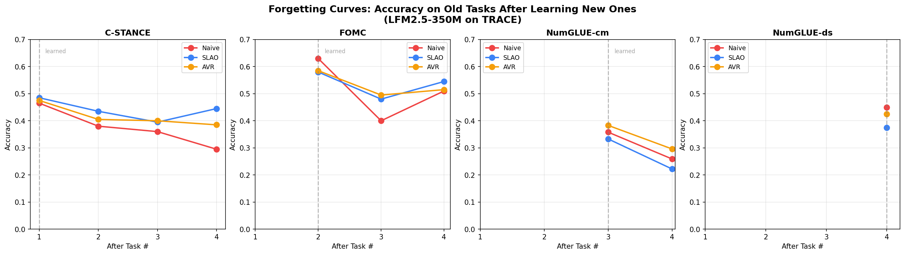
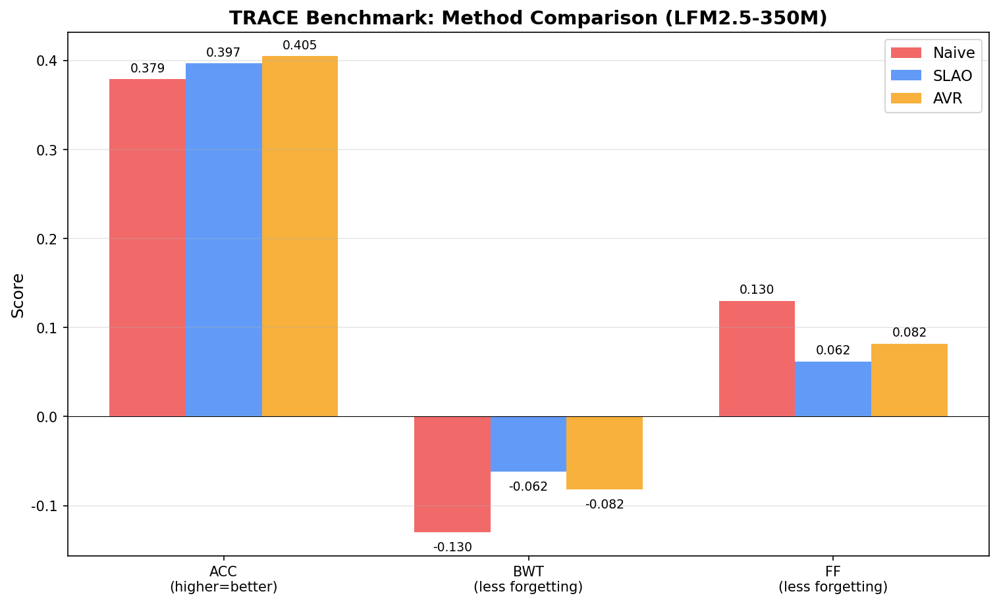

# tiny-cl

A self-improving, on-device language model built on [LiquidAI/LFM2.5-350M](https://huggingface.co/LiquidAI/LFM2.5-350M). It learns new domains without forgetting, recovers from drift, and self-improves — all on a single T4 GPU.

## What's mine, what's borrowed

This project is an **integration and an empirical study**, not a new algorithm. Be clear about that.

| Component | Source | What I did |
|-----------|--------|------------|
| **SLAO** (continual learning) | Qiao & Mahdavi, ICLR 2026 (arXiv 2512.23017) | Implemented, tuned, evaluated on LFM2.5-350M |
| **MVA certainty signal** `KL(U‖p)` | Inspired by INTUITOR, Zhao et al., ICLR 2026 (arXiv 2505.19590) | Adapted as a self-improvement gate, characterized its 79–94% precision ceiling |
| **AVR** (Anchor-Verify-Repair) | **Mine.** Designed in this project. | PPL-ratio drift detector + closed-form weight interpolation repair. First appeared in v11, shipped standalone on TRACE in v23. |
| **LFM2.5-350M** base model | LiquidAI | Used as-is, frozen, with LoRA adapters |
| **TRACE benchmark** | Wang et al. (LLM-CL-Benchmark) | Used as-is for evaluation |

**My contributions:**
1. **AVR** — a model-free drift detector + closed-form weight-space repair. No replay, no gradients, no labels at repair time.
2. **The integration** of SLAO + MVA + AVR on a sub-1B hybrid conv+attention model. Nobody has shipped this combination before.
3. **The empirical study** — first systematic evaluation of these methods on LFM2.5-350M, including the negative results (Fixed-A, ΔW-stitch, rank-64) that rule out alternative explanations.
4. **The "reduced-error filtering" framing** for MVA — honest characterization of what the certainty gate actually does (filters out 60–88% of wrong answers) versus what it doesn't do (generate verified-correct data).

## Headline results

### 1. SLAO holds — 3 domains, 1M tokens each, 3 seeds

| Method   | FF(A) μ±σ         | FF(B) μ±σ         |
|----------|-------------------|-------------------|
| naive    | 1.517 ± 0.020     | 1.406 ± 0.022     |
| **SLAO** | **1.097 ± 0.007** | **1.065 ± 0.005** |

FF(X) = `ppl_X(after all 3 tasks) / ppl_X(right after training on X)`. Lower is better; 1.0 = no forgetting. SLAO retains ~5.5× better than naive sequential SFT.



### 2. SLAO + MVA composes — 1 round of self-improvement on top of SLAO

```
Round            Medical PPL  Code PPL  Creative PPL  pass@5
R1 (Medical)        14.59      5.71      10.00        0.330
R2 (Code)           14.95      3.80       8.48        0.350
R3 (Creative)       16.20      3.93       5.96        0.450
R4 (MVA)            15.52      3.95       6.28        0.520   ← +0.070 pass@5, no PPL spike
```

MVA's certainty gate (inspired by INTUITOR) filters out 60–88% of wrong answers, reducing wrong-answer contamination from ~30% (naive) to ~6–21% (MVA). The pass@5 gain reflects training on fewer mistakes — **not** on verified-correct self-generated data. This is the framing that survives reading the code.

### 3. AVR standalone on TRACE — verify + repair

AVR runs on the TRACE benchmark (4 tasks: C-STANCE, FOMC, NumGLUE-cm, NumGLUE-ds). After each task, it checks PPL on priors and pulls LoRA weights toward a snapshot if any task drifted >1.15×:

```
After training task t:
  1. Snapshot LoRA state S_t
  2. For each prior task j: ratio = ppl_now[j] / ppl_best[j]
  3. If ratio > 1.15: drifted
  4. Repair: θ ← (1 − α)·θ + α·θ_snapshot   (α = 0.1, closed-form)
  5. Repeat until no drift, then next task
```

No replay buffer. No gradient computation during repair. No task-id inference at test time. Run `experiments/v23_avr_trace.py` for numbers.



## Repository

```
tiny-cl/
├── README.md
├── LICENSE                       MIT
├── requirements.txt
├── CITATION.cff
│
├── experiments/                  One file per experiment. Single-cell Kaggle scripts.
│   ├── v13_slao_baseline.py          SLAO continual learning (3 domains, 3 seeds)
│   ├── v14_slao_mva.py               SLAO + 1 MVA round
│   ├── v15_slao_mva_3rounds.py       SLAO + 3 MVA rounds (compounding test)
│   ├── v18_trace_benchmark.py        TRACE: naive vs SLAO+MVA (ACC/BWT/FWT)
│   ├── v23_avr_trace.py              AVR standalone on TRACE (mine)
│   └── mva_validation.py             MVA certainty signal validation (seed 123)
│
└── results/
    ├── forgetting_curves.png         SLAO vs naive, 3-seed forgetting
    └── metrics_comparison.png        ACC / BWT / FWT on TRACE
```

## Run

```bash
pip install -r requirements.txt
python experiments/v13_slao_baseline.py      # ~4-5h on T4 — SLAO continual learning
python experiments/v14_slao_mva.py           # ~3h on T4 — SLAO + 1 MVA round
python experiments/v23_avr_trace.py          # ~2h on T4 — AVR on TRACE
```

Each script auto-installs missing deps, downloads datasets, and is reproducible with `SEED=42` (or `SEED=123` for `mva_validation.py`).

## Config

- **Model:** `LiquidAI/LFM2.5-350M` (frozen, bfloat16)
- **LoRA:** rank 32, alpha 32, dropout 0.05, targets `["in_proj", "out_proj"]` (26 modules)
- **Optimizer:** AdamW, lr 2e-4, wd 0.01, max grad norm 1.0
- **Hardware:** single T4 GPU (Kaggle), 16GB VRAM

## Citation

```bibtex
@misc{tiny-cl-2026,
  author       = {Aryan Thakur},
  title        = {tiny-cl: Self-Improving LFM2.5-350M with SLAO + MVA + AVR},
  year         = {2026},
  url          = {https://github.com/ARYAN2302/tiny-cl},
  note         = {Integrates SLAO (Qiao \& Mahdavi, ICLR 2026) and MVA
                  (inspired by INTUITOR, ICLR 2026) on LiquidAI/LFM2.5-350M.
                  AVR (Anchor-Verify-Repair) is original to this project.}
}
```

## License

MIT — see [`LICENSE`](LICENSE).
